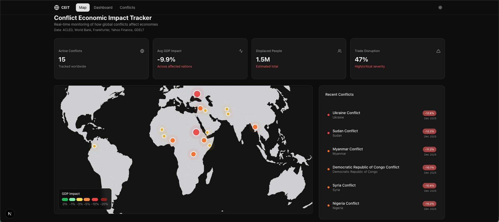

# 🌍 Conflict Economic Tracker

**Conflict Economic Tracker** is an advanced Next.js application designed to track, analyze, and visualize global armed conflicts, political violence, and their real-time impacts on local and global economies.

The project goes beyond just reporting human casualties; it aims to contextualize these events within economic indicators such as GDP growth, inflation, currency fluctuations, and critical commodity prices (Oil, Natural Gas, Wheat, etc.).



## ✨ Key Features

- **Live Conflict Tracking:** Integrated with the UCDP (Uppsala Conflict Data Program) GED API for real-time, coordinate-based conflict event monitoring.
- **Economic Indicators:** Compares conflict data with World Bank Open Data (GDP growth, CPI Inflation, Trade % of GDP).
- **Market Impact Analysis:** Real-time tracking of currency exchange rates (Frankfurter API) and critical commodities (Yahoo Finance).
- **AI-Powered Insights:** Uses specialized prompts for Claude (Anthropic) or Gemini (Google) models to generate automated correlation reports between conflict intensity and market volatility.
- **Interactive Geospatial View:** Dynamic maps built with React-Simple-Maps to visualize conflict density and affected regions.
- **Analytics Dashboard:** Trend visualizations and economic projection charts powered by Recharts.

## 🚀 Tech Stack

- **Framework:** Next.js (App Router)
- **Language:** TypeScript
- **Styling:** Tailwind CSS + Shadcn/UI + Framer Motion
- **Data Visualization:** Recharts + React-Simple-Maps
- **Data Sources:**
  - **Conflict:** [UCDP GED API](https://ucdp.uu.se/apidocs/)
  - **Economy:** World Bank Open Data
  - **Market:** Frankfurter API & Yahoo Finance
- **Artificial Intelligence:** Anthropic Claude SDK & Google Gemini SDK

## 🛠️ Installation

Follow these steps to run the project locally:

1. **Clone the Repository:**

   ```bash
   git clone https://github.com/yourusername/conflict-economic-tracker.git
   cd conflict-economic-tracker
   ```

2. **Install Dependencies:**

   ```bash
   npm install
   ```

3. **Configure Environment Variables:**
   Create a `.env.local` file in the root directory and add your API keys:

   ```env
   # Conflict Data (UCDP)
   UCDP_TOKEN=your_ucdp_token_here (Free, request via email)

   # Intelligence & News
   NEWSAPI_KEY=your_newsapi_key
   ANTHROPIC_API_KEY=your_claude_key
   GEMINI_API_KEY=your_gemini_key
   ```

4. **Start the Development Server:**
   ```bash
   npm run dev
   ```
   Visit [http://localhost:3000](http://localhost:3000) in your browser.

## 📊 About Data Sources

This application utilizes **Uppsala Conflict Data Program (UCDP)** data, which is widely recognized as the gold standard in academic and humanitarian sectors. Access is free, but may require a token for API stability. Please refer to UCDP documentation for token requests.

## 📄 License

This project is licensed under the MIT License. Respective data sources carry their own usage terms and licenses.

---

_Developed by: [Ahmet Kocak](https://github.com/ahmetkocak)_
